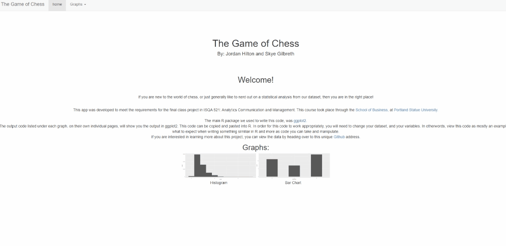

    

<h1 align="center">
  The Game of Chess
</h1>

# Overview
We developed a Shiny App integrated with R as a Final Project for the Business Intelligence and Analytics Graduate Program. 

If you are new to the world of chess, or just generally like to nerd out on a statistical analysis from our dataset, then you are in the right place!

# Introduction

We're beginner chess players, and we'd like to improve our game a little. We have a data set of 20,000 chess games played on the website lichess, including a computer-identified opening used in each game. The goal of this project is to analyze this set of games to find out more about what openings we should study, by looking at the performance of each opening using this data.

This [dataset](https://www.kaggle.com/datasnaek/chess) originates from [kaggle](https://www.kaggle.com) 

